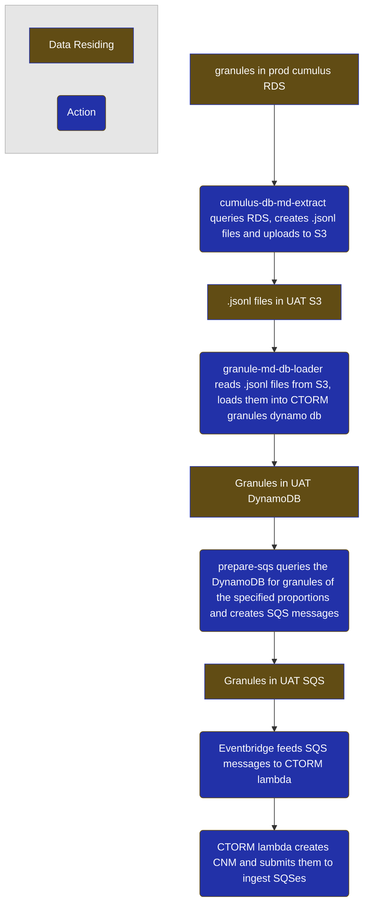

# CTORM

Cumulus Throughput... uh... ORM?

Load tester tool for Cumulus.

Operates as these steps:

* cumulus-db-md-extract
    * Operates in the prod account.
    * Gets the metadata from the cumulus database and writes it to a bunch of .jsonl files in a S3 bucket in the
      operational account.
* granule-md-db-loader
    * Operates in the account in which the load test will operate.
    * Reads the .jsonl files from the S3 bucket and loads them into the CTORM granules dynamo db.
